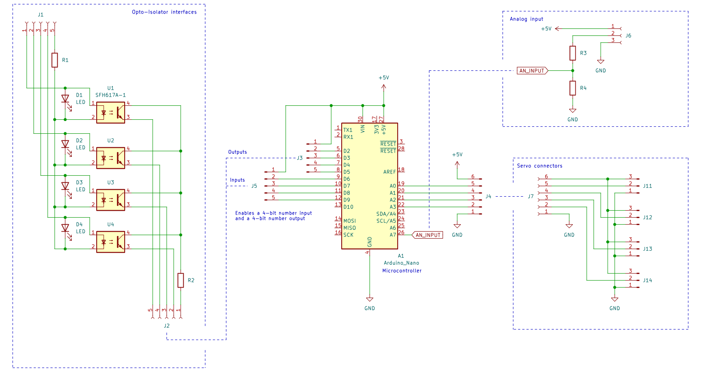

# Servostation

Version:        **0.0.1**  
Update date:    **17/01/2023**  

## Description

A simple component for controlling multiple servo motors.

## Project Data
Created on:     **10/01/2023**  
Author:         **Samuel Nösslböck**  
Client:         **Gregor Nösslböck**  
Institution:    **HTL Neufelden**

## Components

## Summary

### Electronics

The electonics consist of three main parts, the input/output panels, the arduino nano (the main processor) and the opto-isolator boards.
